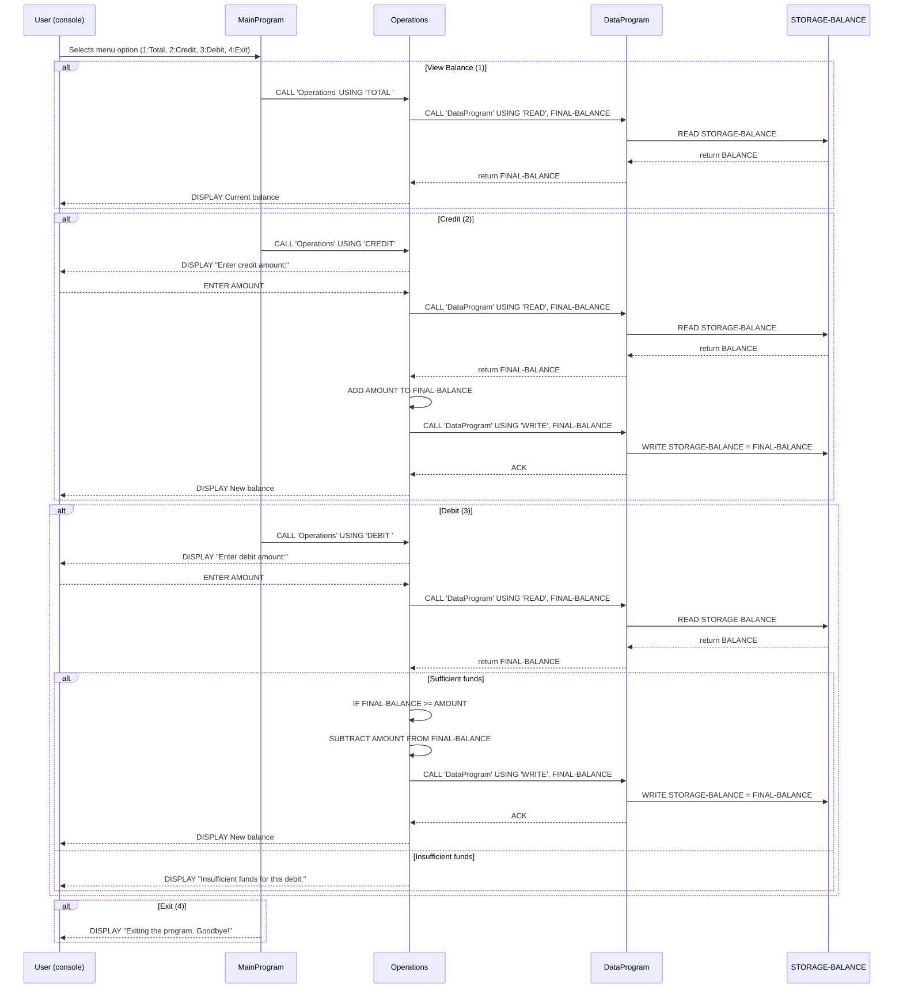

Project: COBOL Student Account Management
======================================

Overview
--------
This small COBOL sample implements a simple account management console app (student accounts). It demonstrates a minimal separation between data storage (`DataProgram`), business operations (`Operations`), and a user-facing menu (`MainProgram`). The system stores a single account balance in working-storage and supports viewing the total, crediting, and debiting the account.

Files
-----
- `src/cobol/data.cob`
  - Purpose: Provides a tiny persistent-like storage abstraction for the account balance.
  - Key routines/behavior:
    - `PROGRAM-ID. DataProgram` with `PROCEDURE DIVISION USING PASSED-OPERATION BALANCE`.
    - Uses `STORAGE-BALANCE` (working-storage) as the stored account value.
    - Accepted operations (via the 6-character `PASSED-OPERATION`):
      - `READ`  — moves `STORAGE-BALANCE` into the passed `BALANCE` parameter.
      - `WRITE` — moves the passed `BALANCE` parameter into `STORAGE-BALANCE`.
  - Data types:
    - `STORAGE-BALANCE` is `PIC 9(6)V99` and initialized to `1000.00`.
  - Notes: The program relies on fixed-width operation codes (6 characters) and expects the caller to supply an appropriately padded string.

- `src/cobol/operations.cob`
  - Purpose: Implements the account operations (view total, credit, debit) and coordinates with `DataProgram` for reading/writing the balance.
  - Key routines/behavior:
    - `PROGRAM-ID. Operations` with `PROCEDURE DIVISION USING PASSED-OPERATION`.
    - Moves the incoming `PASSED-OPERATION` into a local `OPERATION-TYPE` and branches by value.
    - Operation handlers:
      - `TOTAL ` — calls `DataProgram` USING `READ`, FINAL-BALANCE and displays the current balance.
      - `CREDIT` — prompts for an amount, reads the current balance, adds the amount, writes the updated balance back, and displays the new balance.
      - `DEBIT ` — prompts for an amount, reads the current balance, checks if the balance is sufficient, subtracts the amount, writes the new balance, and displays the new balance; if insufficient funds, shows an error message.
  - Data types:
    - `AMOUNT` and `FINAL-BALANCE` are `PIC 9(6)V99` (two decimal places).
    - `FINAL-BALANCE` is initialized to `1000.00` (local default fallback).
  - Notes: The program calls `DataProgram` with two parameters for `READ`/`WRITE` but itself declares only `PASSED-OPERATION` in the linkage section — the sample uses positional CALL/USING to pass/read balances; callers must match the expected parameters.

- `src/cobol/main.cob`
  - Purpose: Console menu and program loop; performs user interaction and delegates work to `Operations`.
  - Key routines/behavior:
    - `PROGRAM-ID. MainProgram` with a main loop `MAIN-LOGIC` that presents a menu and `ACCEPT`s user choices.
    - Menu options and actions:
      - `1` — Calls `Operations` USING `'TOTAL '` to view balance.
      - `2` — Calls `Operations` USING `'CREDIT'` to credit the account.
      - `3` — Calls `Operations` USING `'DEBIT '` to debit the account.
      - `4` — Sets a flag to exit the loop and terminate the program.
    - Input handling is minimal: invalid choices show an error message and re-display the menu.

Business Rules (student accounts)
-------------------------------
- Initial balance: Accounts start with `1000.00` by default (both `STORAGE-BALANCE` and `FINAL-BALANCE` initial values).
- Monetary format: Amounts are stored as `PIC 9(6)V99` — up to 6 integer digits and 2 fractional digits.
- Credit rule: When crediting, the entered `AMOUNT` is added to the current balance and the updated balance is stored.
- Debit rule: Debit is allowed only if `FINAL-BALANCE >= AMOUNT`. If not, the operation is rejected and an "Insufficient funds" message is shown — no overdrafts.
- Operation codes: Operation names passed between programs are fixed-length (6 characters). Codes must be padded as used in the source (for example `'TOTAL '` and `'DEBIT '` include trailing spaces to reach 6 chars).
- Input validation: Minimal. The program expects valid numeric input for amounts and does not sanitize non-numeric input; invalid entries may cause runtime errors depending on the COBOL runtime.

Maintenance and Extensibility Notes
----------------------------------
- Single-account model: The current code supports a single global account balance; to support multiple student accounts you would:
  - introduce account identifiers when calling `DataProgram` and store balances in a keyed data structure or external file/DB,
  - extend the `USING` parameter lists and validate identifiers.
- Persistence: `DataProgram` uses working-storage for `STORAGE-BALANCE`, so data is not persistent across runs. To persist balances, hook `DataProgram` into a file or database.
- Input validation: Add parsing and validation for numeric input (reject negative amounts, non-numeric characters, or too-large values).
- Internationalization: Monetary formatting assumes a decimal point; adapt for locale-specific formatting when needed.

Where to look in the code
-------------------------
- User menu and program loop: `src/cobol/main.cob` (`MAIN-LOGIC`).
- Business operations (credit/debit/total): `src/cobol/operations.cob` (branching on `OPERATION-TYPE`).
- Data access layer (read/write balance): `src/cobol/data.cob` (`DataProgram` CALL/USING interface).

Contact / Next steps
--------------------
If you want, I can:
- add simple input validation to `Operations` to reject invalid amounts,
- persist balances to a file and demonstrate multi-account support,
- or create unit-style tests / a small runner to exercise typical flows.

README generated from repository COBOL sources.

Sequence Diagram (Mermaid)
--------------------------

